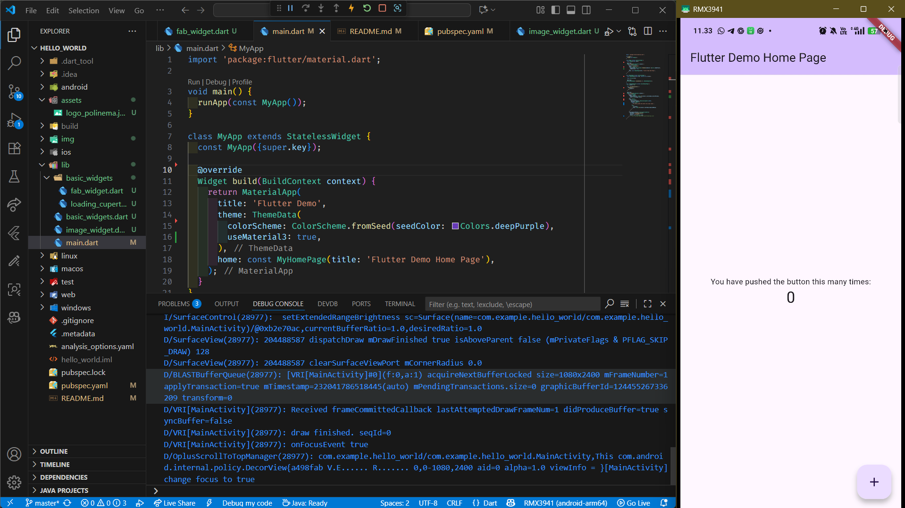
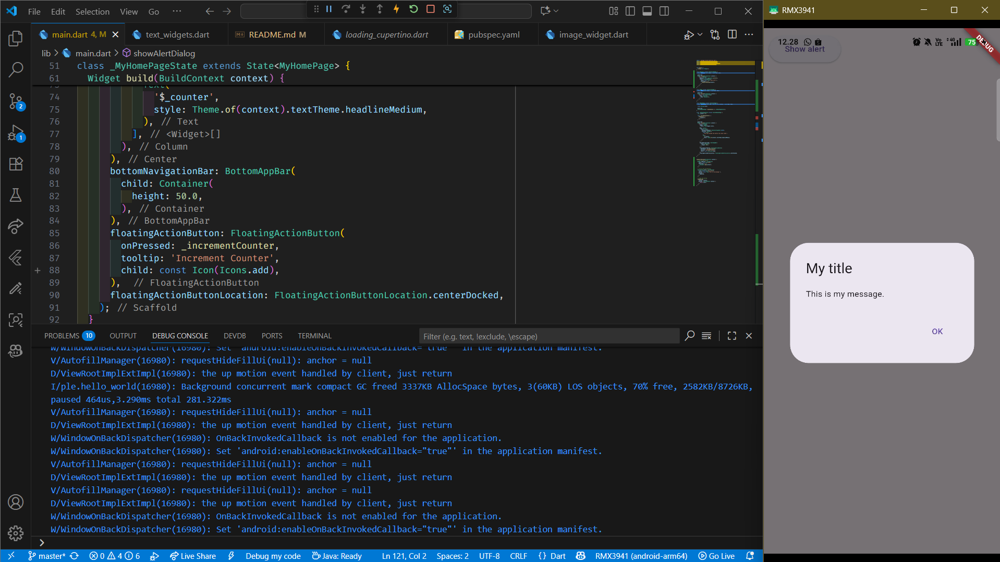

# 📑 APLIKASI PERTAMA DAN WIDGET DASAR FLUTTER  

<table>
  <tr>
    <td><b>Nama</b></td>
    <td>:</td>
    <td>Afifah Khoirunnisa</td>
  </tr>
  <tr>
    <td><b>Kelas</b></td>
    <td>:</td>
    <td>TI-3G</td>
  </tr>
  <tr>
    <td><b>NIM</b></td>
    <td>:</td>
    <td>2341720250</td>
  </tr>
  <tr>
    <td><b>No. Abs</b></td>
    <td>:</td>
    <td>02</td>
  </tr>
</table>  

---

## PRAKTIKUM 1
**Membuat Projek di VS CODE**

## PRAKTIKUM 2
Berhasil menghubungkan Perangkat Android dengan Emulator. Namun, pada kesempatan kali ini, saya menggunakan VSCODE dan software scrcpy untuk mirroring layar HP ke laptop supaya lebih mudah di screenshoot.

## PRAKTIKUM 3

### Langkah 10
**Membuat Projek di Github**

### Langkah 11-12
**Kembali ke VS Code, ubah platform di pojok kanan bawah ke emulator atau device atau bisa juga menggunakan browser Chrome. Lalu coba running project hello_world dengan tekan F5 atau Run > Start Debugging. Tunggu proses kompilasi hingga selesai, maka aplikasi flutter pertama Anda akan tampil seperti berikut.**

## PRAKTIKUM 4
### Langkah 1: Text Widget

### Langkah 2: Image Widget

## PRAKTIKUM 5
### Langkah 1 - 3 

### Langkah 4 

### Langkah 5

### Langkah 6

## TUGAS PRAKTIKUM
**4. Selesaikan Codelabs: Your first Flutter app, lalu buatlah laporan praktikumnya dan push ke repository GitHub Anda!**

